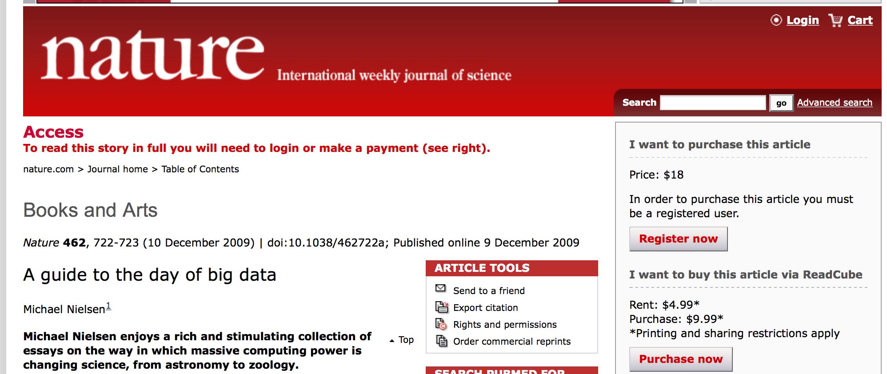

# What is Reproducibility?


[Gandrud 2014](Gandrud_Reproducible_Research_with_R_and_RStudio.pdf) gives this definition (especially for data analysis and computer science):

> "The data and code used to make a finding are available and they
> are presented in such a way that it is (relatively) straightforward
> for an independent researcher to recreate the finding."


## This actually seldom happens.  

Consider two interesting articles by Tim Vines: 
* [The Availability of Research Data Declines Rapidly with Article Age](http://www.sciencedirect.com/science/article/pii/S0960982213014000)
  + Contacted Authors of 516 datasets with morphological data for discriminant analysis published between 1991 and 2011
  + Received only 101 datasets!

  + "_of 516 articles published between 2 and 22 years ago...the odds of a data set being extant fell by 17% per year._"

---


### Data not only need to be easily available, but methods also need to be reproducible

* Gilbert et al. 2012 - [Recommendations for utilizing and reporting population genetic analyses: the reproducibility of genetic clustering using the program structure](http://onlinelibrary.wiley.com/doi/10.1111/j.1365-294X.2012.05754.x/full)
  + "_we reanalysed data sets gathered from papers using the software package 'structure'... 30% of analyses were unable to reproduce the same number of population clusters._"

* Scientific articles have fairly detailed methods sections, but those are typically insufficient to actually reproduce an analysis.

* Scientists owe it to themselves and their community to have an explicit record of all the steps in an analysis done at a computer.


# Why are Open Data and Reproducibility Important? 

## For Science?

* Standard to judge scientific claims
* Data and methods need to be openly available in order to be reproducible
* Avoiding effort duplication
* Encouraging cumulative knowledge development


[Gandrud 2014](Gandrud_Reproducible_Research_with_R_and_RStudio.pdf)

## Open Science


[Open Science Links](http://en.wikipedia.org/wiki/Open_science)

* Open Data
* Reproducible Methods
* Open Access Publications




## Why are Open Data and Reproducibility Important for *You*?


* Better work habits
  + better, clearer documentation
* Better teamwork
* Re-analysis is easier
* Higher research impact


[Gandrud 2014](Gandrud_Reproducible_Research_with_R_and_RStudio.pdf)


# Tools for Research Reproducibility

* Open Source Everything
* R language
* Rstudio and knitR
* Markdown and LaTeX
* Unix operating system
* GitHub and git - version control (not covered in this class)
* Creative Commons Licensing
* [Online Repositories](http://oad.simmons.edu/oadwiki/Data_repositories) (Dryad, Genbank,GBIF, GEOME, new ones all the time)


## Reproducible Research Habits

Good habits to get into as a student!
 
[10 Things Every Graduate Student Should Do](http://datapub.cdlib.org/2014/10/14/the-10-things-every-new-grad-student-should-do/) By Carly Strasser


## Stop Using Excel!

* OK, maybe not entirely - its good for quick visualizing, data entry, etc.
* It tends to be a crutch.
  + Stops you from thinking carefully about your data structure
  + Stops you from learning better ways to handle data
* Proprietary software
* Easy to mess up your data, no provenance
* [Dates!](http://support.microsoft.com/kb/214330)
* At least keep your raw data in text format

## Learn to Code

Any language.  

R is a great starting place.

Here is code to paste cells from excel into an R data frame!


```r
data <- read.table(pipe("pbpaste"),header=T) 
```


## Make a plan for managing data in each project

* Keep all data (and ideally analyses) in a text file
* Think about your file structure


## Make a plan for managing data in each project - 2

* Document everything
* Explicitly tie your files together
* Data management plans are now explicitly required by the NSF and other funding agencies!!!


## Keep an electronic (online) notebook

* Document everything!!
    * repeat your own analysis!!
    * show others what you did
    
* Dokuwiki is great (keeps things in plain text)

* I now use GitHub and Rmarkdown notebooks

* [Go open if you're brave](https://ericcrandall.github.io/Palythoa_tuberculosa/)


## Communicate Your Science

Start doing outreach now!

[NSF vs. House Committee on Science](http://news.sciencemag.org/policy/2014/10/battle-between-nsf-and-house-science-committee-escalates-how-did-it-get-bad)


## Publish Open-Access Articles

* [Biology Failed the Internet](https://www.youtube.com/watch?v=fmeI_X3Ppow)
  + Physics moved to pre-print servers a long time ago!
  + Open access journals (e.g. PLoS) were supposed to be a stop-gap measure!
* Many schools now have open-access funds
* [The dark side of open-access](http://www.nytimes.com/2013/04/08/health/for-scientists-an-exploding-world-of-pseudo-academia.html)
* Most journals only own the "typesetting" (because that is all they did!). 
  + [Therefore you may legally post a pre-print](http://datapub.cdlib.org/2012/11/06/researchers-make-your-previous-work-oa/)
  + BiorXiv
  + PeerJ
  + Most universities now have pre-print platforms
* ResearchGate, Academia.edu etc. are social networks whereby you are sharing articles with your "friends"

## Rstudio


R studio is an Integrated Developer Environment for R
* Is an IDE (integrated development environment) that _sits on top of_ R
and makes it easier to interact with R.
* Organizes your work in R in neatly-contained packages of work (typically data
and code) called "projects"
* Nothing mysterious about these---just collections of files stored together in
a single directory on your computer.


# Git and GitHub

* Thanks to [Eric Anderson](https://eriqande.netlify.app) for portions of the git/github part of this lecture


## Git

* A version control system, or VCS, tracks the history of changes as people and teams collaborate on projects together. As the project evolves, teams can run tests, fix bugs, and contribute new code with the confidence that any version can be recovered at any time. Developers can review project history to find out:
  + Which changes were made?
  + Who made the changes?
  + When were the changes made?
  + Why were changes needed?

* All of this is stored as "commits" inside an invisible directory called .git


```bash
/reproducible_research/--% ls .git
COMMIT_EDITMSG  config          hooks           info            objects         refs
HEAD            description     index           logs            packed-refs
```


## A typical VCS for a non-computer programmer

* Start writing `my_manuscript.doc`.
* At some point worry that MS Word is going to eat your file, so,
    + Make a "backup" called `my_manuscript_A.doc`
* Then, before overhauling the discussion, save the current file as
`my_manuscript_B.doc`. 
* Email it to your coauthors and then have a series of files with other
extensions such as the initials of their names when they edit them and send
them back.
* Etc.
* Disadvantages:
    + Hard to find a good record of what is in each version.  (Wait! I liked the introduction
    I wrote three weeks ago...where is that now?)
    + A terrible system if you have multiple files that are dependent on one another
    + If you decide that you want to merge the changes you made to the discussion 
    in version `_C` with the edits on the introduction in version `_K`, it is hard.
  
## GitHub (and others) is a distributed version control system (DVCS)

* Git stores "snapshots" of your collection of files in a repository, which can be stored on GitHub
* For our work, the "collection of files" will be "the stuff in your RStudio project"
    + Another reason it is nice to keep everything you need for a project together in a "project directory"
* When you clone or repository, __you__ get the whole version history 
* When someone else clones that repository, __they also__ get the whole version history.
* Git has well-developed features for merging changes made in different repositories
* Unlike once popular centralized version control systems (rcs, cvs, subversion), DVCSs like GitHub don’t need a constant connection to a central repository. Developers can work anywhere and collaborate asynchronously from any time zone.


## GitHub (and others) is a distributed version control system (DVCS)


* Git and a DVCS system allow multiple people to work on multiple versions ("branches") of a piece of software at the same time, without breaking the main branch. This approach can be used to add features or fix bugs.

* To eliminate unnecessary work, Git and other VCSs give each contributor a unified and consistent view of a project, surfacing work that’s already in progress. Seeing a transparent history of changes, who made them, and how they contribute to the development of a project helps team members stay aligned while working independently.

* Without version control, team members are subject to redundant tasks, slower timelines, and multiple copies of a single project.

## GitHub Example for Software


## What's a repository?

* A *repository*, or [Git](https://git-scm.com) project, encompasses the entire collection of files and folders associated with a project (i.e. a directory), *along with each file’s revision history*. 

* The file history appears as snapshots in time called *commits*, and can be organized into multiple lines of development called branches. 

* Because Github is a DVCS, repositories are self-contained units and anyone who owns a copy of the repository can access the entire codebase and its history.

* Using the command line or other ease-of-use interfaces, a git repository also allows for: interaction with the history, cloning, creating branches, committing, merging, comparing changes across versions of code, and more.


## What's a repository?

* Working in repositories keeps development projects organized and protected. Developers are encouraged to fix bugs, or create fresh features, without fear of derailing mainline development efforts. 

* Through platforms like GitHub, Git also provides more opportunities for project transparency and collaboration. Public repositories help teams work together to build the best possible final product.


## The Github Flow

[Video](https://www.youtube.com/watch?v=47E-jcuQz5c)


## The GitHub Flow

The GitHub flow has six steps, each with distinct benefits when implemented:

* Create a branch:Topic branches created from the canonical deployment branch (usually master) allow teams to contribute to many parallel efforts. Short-lived topic branches, in particular, keep teams focused and results in quick ships.

* Add commits:Snapshots of development efforts within a branch create safe, revertible points in the project’s history.

* Open a pull request:Pull requests publicize a project’s ongoing efforts and set the tone for a transparent development process.

## The GitHub Flow

* Discuss and review code:Teams participate in code reviews by commenting, testing, and reviewing open pull requests. Code review is at the core of an open and participatory culture.

* Merge:Upon clicking merge, GitHub automatically performs the equivalent of a local ‘git merge’ operation. GitHub also keeps the entire branch development history on the merged pull request.

* Deploy:Teams can choose the best release cycles or incorporate continuous integration tools and operate with the assurance that code on the deployment branch has gone through a robust workflow.


## Alternatives to Github exist!

* Bitbucket
* Gitlab
* Gitbucket

All work on a "freemium" model in which they provide free service to low-end users (like us), but charge for services needed by power users (like private repositories, more file storage space)

# GitHub Tutorial


## Do this in GitHub

1. Go to https://github.com/ericcrandall/reproducible_research
2. Click "Fork" in the upper right-hand corner and follow dialogue
prompts to create fork in your account

## Do This in RStudio

1. Select File -> New Project 
1. Create project from:  Choose "Version Control"
    1. Choose "Git"
    1. Input the url of this repository
      1.https://github.com/*yourusername*/reproducible_research
    1. and put it somewhere 
      1. I suggest a repository coming off your home directory called `github`.
      1. (browse to where you want to put it in the "create project as subdirectory of:")
      1. So it should be in `yourhome/github/reproducible_research`
    1. Hit `Create Project`


## The status/staging panel

* RStudio keeps git constantly scanning the project directory to find any files
that have changed or which are new.
* By clicking a file's little "check-box" you can stage it.  
* Some symbols:
    + __Blue-M__: a file that is already under version control that has been modified.
    + __Yellow-?__: a file that is not under version control (yet...)
    + __Green-A__: a file that was not under version control, but which has been staged to be 
    committed.
    + __Red-D__: a file under version control has been deleted.  To make it really disappear, you have 
    to stage its disappearance and commit.
    + __Purple-R__ a file that was renamed.  (Note that git in Rstudio seems to be
    figuring this out on its own.)

## Staging Files

* You can click the check box next to various files to stage them to be part of a commit.
    + I generally stage all changes for every commit
    + But one could conceive of being more strategic...
    + at the command line, staging or adding all files to a commit is achieved by:
    

```bash
git add .
```

 
## The Commit window

* Click "commit" to reach the commit window
* Shows a "diff" of your changes.
* In other words, what has changed between the last committed version of a file and its
current state.
* Green = additions, red = deletions
* Holy smokes this is convenient
* (Note: all this output is available from the command line, but
the Rstudio interface is very nice, IMHO)


## Making a Commit

* Super easy:
    + After staging the files you want to commit...
    + Write a brief message (first line short, then as much after that as you want)
    and hit the commit button. 
* Tradition is to use present tense when describing your changes.
    + as in "Add new data file, update file slurping code"
* This can be really handy when trying to find where you made an error!
* Spending a little time to write informative commit messages can pay off.
* At the command line, a commit is achieved thusly:


```bash
git commit -m "my commit message"

```

 
## The History window

* Easy inspection of past commits.
* See what changes were made at each commit.
* At the command line you can see this with 

```bash
git log
```


## How does git store and keep track of things {#git-how}

* Everything is stored in the .git folder inside the RStudio project.
* The "working copy" gets checkout out of there
* Committed changes are recorded to the directory


## What is inside of the .git directory?

We can use R to list the files.  


```r
# check out this file-system command in R
dir(path = ".git", all.files = TRUE, recursive = TRUE)
```

```
##  [1] "COMMIT_EDITMSG"                                                 
##  [2] "config"                                                         
##  [3] "description"                                                    
##  [4] "HEAD"                                                           
##  [5] "hooks/applypatch-msg.sample"                                    
##  [6] "hooks/commit-msg.sample"                                        
##  [7] "hooks/fsmonitor-watchman.sample"                                
##  [8] "hooks/post-update.sample"                                       
##  [9] "hooks/pre-applypatch.sample"                                    
## [10] "hooks/pre-commit.sample"                                        
## [11] "hooks/pre-merge-commit.sample"                                  
## [12] "hooks/pre-push.sample"                                          
## [13] "hooks/pre-rebase.sample"                                        
## [14] "hooks/pre-receive.sample"                                       
## [15] "hooks/prepare-commit-msg.sample"                                
## [16] "hooks/push-to-checkout.sample"                                  
## [17] "hooks/update.sample"                                            
## [18] "index"                                                          
## [19] "info/exclude"                                                   
## [20] "logs/HEAD"                                                      
## [21] "logs/refs/heads/main"                                           
## [22] "logs/refs/remotes/origin/HEAD"                                  
## [23] "logs/refs/remotes/origin/main"                                  
## [24] "objects/00/f53ce8066a38abfe40f99ffb0a445aa32b8011"              
## [25] "objects/02/70d3cbc9f83e4c2eb1e11d0a147c31e5a644c0"              
## [26] "objects/10/c739a3d513015f61e52b5d978604f9d0d8f291"              
## [27] "objects/11/bcf458a321651e68c7627ef6890bafccef0b18"              
## [28] "objects/13/23e55fd16b1e4f7965bacc0223492a178de5dd"              
## [29] "objects/16/a9cdea4ad9456d9f9c661f24a9a3eb57e689c6"              
## [30] "objects/19/85083191e8b2f5505f36625f7edcb1a0d6412f"              
## [31] "objects/1f/3ede9a9f986201addf75b29e70fa8c2a8477f9"              
## [32] "objects/21/f7e34c7ff8b756b03724b544f5e2ce2b9b082f"              
## [33] "objects/23/f63b97abe22805008c32a9658bfc895538b6aa"              
## [34] "objects/24/f75cad5b119c80678c244d47312d0ad02fc670"              
## [35] "objects/26/2b2cfc8ba24c825f6b64acbe3ca395b7ff2f31"              
## [36] "objects/28/f0057bd3f9d33a7ace7e366f7ffa4dc210f944"              
## [37] "objects/2a/c44c9b964f841a8a24cc396a7fb2876b8e8aa5"              
## [38] "objects/2c/ad0aa1a595ebf0779e1388933dac6b412a7114"              
## [39] "objects/36/548b376ebcc447a10b93353cd9b1dc0b259b06"              
## [40] "objects/37/2f57b5b80902a0eb6202670cb509eb321be2be"              
## [41] "objects/3d/3116d6bc440e1415d17474676199ffb85f545f"              
## [42] "objects/50/45808a94d041c6f6b785bf9c7fcc6ca550d3eb"              
## [43] "objects/51/6fb82804f5d310f7e3e16b9138291527f0fd2a"              
## [44] "objects/66/c1d3e45021859c6a7d5bf4b6a5f4c8fd0ce340"              
## [45] "objects/70/1f64ed543adeb4a93909fb7db24076c7ff0590"              
## [46] "objects/70/e9f8bc14094dfe37e0994c17dbbb536a3a3d48"              
## [47] "objects/7b/3778658c5a9060a506261167781e5d18c33841"              
## [48] "objects/80/70e6a38cc8a0742e7c13872f8ef41b644528c7"              
## [49] "objects/81/17a4006e63621d735764ad2d51daa41a8ed605"              
## [50] "objects/83/002948bce0dcb03b633293a58dc2a776bf88ef"              
## [51] "objects/86/5d5629ef55987fe68127c149a3c5050ab237d0"              
## [52] "objects/8e/3c2ebc99e2e337f7d69948b93529a437590b27"              
## [53] "objects/96/f3bba4fe892703a8e364e79e08cc07721eccd5"              
## [54] "objects/99/1898f18b7e0fc860e99e701e8ffceeb8ad2ed9"              
## [55] "objects/bc/746a8952dc080a92ad1157f4280792168b1b87"              
## [56] "objects/c8/959054c5e1331ea7170c3d94c487563782269a"              
## [57] "objects/cb/b99a7196a266cb4e958f2bfc031bf478422080"              
## [58] "objects/cd/dcc43841aa35f5553ab949d7c98f640074c576"              
## [59] "objects/d0/603c55847f6fb92b975f6c989f4f24a7ffe131"              
## [60] "objects/d0/63e8bc7af719bae7c8eb42a8bc12891480f305"              
## [61] "objects/d2/11a25fb11a40ea713785f8e91c066682ca8e87"              
## [62] "objects/d2/23b29197c549e12c83368d039f791fd74c3f93"              
## [63] "objects/d4/c50d6843671ed282ae1d42d314c2edf01a8d76"              
## [64] "objects/e7/cdfc9e85df4a28de8208cb8fff47fa8880ec97"              
## [65] "objects/e8/a26260ce3b15f4349b41e19fc96f4ac05db927"              
## [66] "objects/ea/0cbadfc24142a0ab84ef1ca35c5badf5f9318e"              
## [67] "objects/ed/de644a9bc63ad2e7adafb59ab3f161c237673e"              
## [68] "objects/f6/2cd7ba4a791cccad8b3ba40b15e023803be5a3"              
## [69] "objects/f9/bac9fa4535cde8e9166a09ed4cc091aa4255b0"              
## [70] "objects/fd/94b1c9d48ef9cbf72354a4eb9c57e923619b70"              
## [71] "objects/fe/34adfb051b10b4fe9552744c72059ede597991"              
## [72] "objects/pack/pack-73ddbaccd0bd543cfe129a05ce137348072fa9db.idx" 
## [73] "objects/pack/pack-73ddbaccd0bd543cfe129a05ce137348072fa9db.pack"
## [74] "packed-refs"                                                    
## [75] "refs/heads/main"                                                
## [76] "refs/remotes/origin/HEAD"                                       
## [77] "refs/remotes/origin/main"
```


*Yikes!*


## How does git know a file has changed?

* Does it just look at the modification date?
* NO! It "fingerprints" every file, so it knows when it has changed from the most recent
committed version.
    + Demonstration.  Change a file. Save, then undo the change and save again...Git knows
    the file has been changed back to its "former self"
* SHA-1 hashes.
* You will see things like `ed00c10ae6cf7bcc35d335d2edad7e71bc0f6770` all over in Git-land.
* You can treat them as very specific names for different commits.


## How can I make git ignore certain files?

* The `.gitignore` file!
* File names (and patterns) in the `.gitignore` file are ignored _recursively_ (down into subdirectories), 
by default.
* Files won't be ignored if they are already in the repository.
* Example: `*.html`
## Go for it everyone! Git to playing
* Make some changes and commit them yourselves.  
* Add some new files to the project, and commit those.
* Get familiar with the diff window.
* Check the history after a few commits.


## Intro to Rmarkdown
* Designed as a text _markup_ language that would be
    + Simple
    + Expressive
    + Intuitive
    + Capable of conveying intent even without being
      compiled into HTML or PDF
* There are many Markdown interpreters.  The Rstudio folks
  have been using [pandoc](http://johnmacfarlane.net/pandoc/)
  to crunch Markdown into other formats. It provides many useful
  extensions.
* Customizations of style are mostly separate from the __content__.
  
* [This presentation was made in Rmarkdown!](https://bookdown.org/yihui/rmarkdown/presentations.html)


## To Do

Add Merge Conflicts
Add Revert
Add Rebase
Add "github pages"
* Open the shell (Tools->Shell...) and issue these two commands,
replacing the name "John Doe" with yours, and his email with yours.
    + Use the email address that you gave to GitHub.
    

```bash
git config --global user.name "John Doe"
git config --global user.email johndoe@example.com
```
